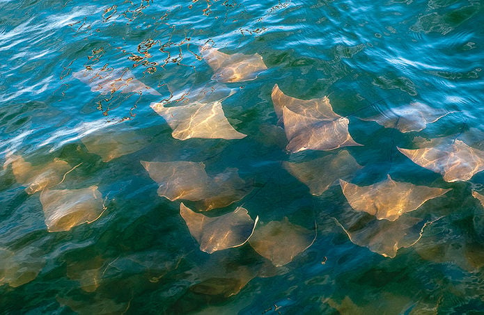
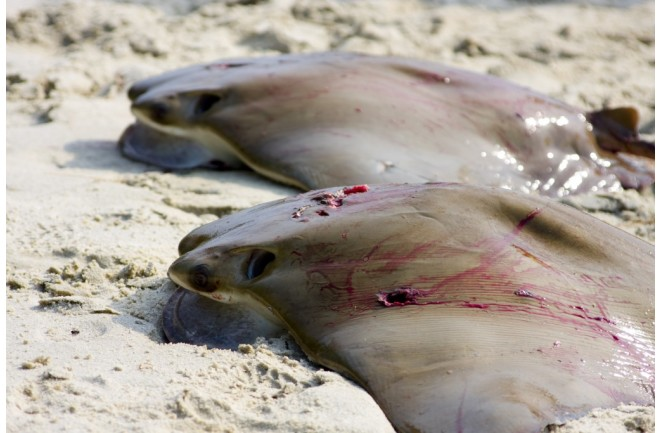

https://github.com/vfong3/Fong_ENV872_FinalProject

```{r setup, include=FALSE}
# Load your packages
library(tidyverse); library(here); library(lubridate); library(sf); library(mapview); library(leaflet); library(trend); library(Kendall); library(knitr)

# Set your working directory
setwd(here())

# Set your ggplot theme
my_theme <-  theme(
    plot.title = element_text(face = "bold", size = 12),
    panel.background = element_rect(fill = "white", colour = NA), 
    panel.border = element_rect(fill = NA, colour="grey50"), 
    panel.grid.major = element_line(colour = "black", size = 0.01),
    panel.grid.minor =  element_line(colour = "black", size = 0.01),
    axis.text = element_text(size = 10),
    axis.ticks = element_blank()
  )

# Load your datasets
obis_nc <- read.csv(here('Data/Processed/obis_NC_2000-2019.csv'))
```


# Rationale and Research Questions

*Fever of cownose rays swimming near the surface. (Image credit: Chesapeake Bay Journal)*


Cownose rays (*Rhinoptera bonasus*) are considered a 'Vulnerable' species by the IUCN Red List globally due to over-fishing (Carlson et al. 2020). In the United States specifically, cownose rays have had a long history of negative interactions with commercial shellfish industries, specifically oyster aquaculture in the Chesapeake Bay, Maryland and bay scallop fisheries in North Carolina (NC Division of Marine Fisheries 2007). This conflict was further exacerbated by a study published in 2007 claiming that top-down predation release was responsible for shellfish decline (Myers et al. 2007), which led to the formation of “Save the Bay, Eat a Ray” campaigns to facilitate recovery of oyster populations in Chesapeake Bay. In 2016, Grubbs et al. rebutted the trophic cascade and the implication that cownose rays caused the collapse of shellfish populations, warning the risk of overexploitation of the slow-reproducing species.

*Dead cownose rays from “Save the Bay, Eat a Ray” campaigns. (Image credit: Discover Magazine)*


This project aims to investigate the temporal and spatial distribution of cownose rays in North Carolina using open-source data. North Carolina was chosen as the study location as there has been minimal research on cownose rays in the state. The only recent study found higher occurences of cownose rays in late spring and summer months between 2004 and 2006 (Goodman et al. 2010), but no follow-up work has been conducted. This project will investigate the following questions:
  1. What is the temporal distribution of cownose rays in North Carolina? 
    1a. What are the annual trends? Did sightings increase after “Save the Bay, Eat a Ray” campaigns were no longer encouraged following the 2016 study?
    1b. What are the seasonal trends?
  2. What is the spatial distribution of cownose rays in North Carolina?
    2a. Are there seasonal trends in spatial distribution?


# Dataset Information
Sightings of cownose rays were obtained from OBIS-SEAMAP (https://seamap.env.duke.edu/), an open-source database for sharks, rays, turtles, seabirds and marine mammals (Halpin et al. 2009). A search for cownose rays resulted in 32,922 records from 66 datasets (government, academic, and private institutions) globally. Since there are no long term studies on cownose rays, these data were collected opportunistically and survey efforts were not standardized. 

**Table 1.** Dataset Information

| Detail | Description |
|-:|:-|
| Data Source | OBIS-SEAMAP |
| Retrieved From | https://seamap.env.duke.edu/species/160985|
| Variables Used | latitude, longitude, group_size, date_time |
| Date Range | 2000-2019 |

North Carolina sightings were filtered from the global dataset using the state's northern (36.588056) and southern (33.843056) latitudinal boundaries. Year, month, and date were extracted from the date_time column, then filtered to only contain sightings since the year 2000. Sightings that did not specify group size were assumed to represent at least one individual and were assigned a group size of 1 as a conservative approach. A cleaned dataset was then created with only the necessary columns for this analysis (latitude, longitude, group_size, date, month, year). The spatial data was provided in the WGS 1984 datum and transformed to UTM Zone 17N for geospatial analysis. 


# Exploratory Analysis 
Initial explorations into the temporal distrbution of cownose rays in North Carolina focused on visualizing the number of sightings by year (Fig. 1) and month (Fig. 2). Initial exploration of spatial distribution mapped the location of each sighting (Map 1).

**Figure 1.** Number of Cownose Ray Sightings in North Carolina by Year (2000-2019)
```{r Figure1, echo=FALSE}
obis_nc$year <- as.factor(obis_nc$year)
obis_nc$month <- as.factor(obis_nc$month)

fig1 <- obis_nc %>%
  group_by(year) %>%
  summarise(count = n()) %>%
  ggplot(aes(x=year, y=count)) +
  geom_bar(stat="identity") +
  scale_x_discrete(guide = guide_axis(angle = 90)) +
  labs(title = "2000-2019 NC Cownose Ray Sightings") +
  my_theme
fig1
```

**Figure 2.** Number of Cownose Ray Sightings in North Carolina by Month (2000-2019)
```{r Figure2, echo=FALSE}
fig2 <- obis_nc %>%
  group_by(month) %>%
  summarise(count = n()) %>%
  ggplot(aes(x=month, y=count)) +
  geom_bar(stat="identity") +
  labs(title = "2000-2019 NC Cownose Ray Sightings by Month") +
  my_theme
fig2
```

```{r Map1code, include=FALSE}
obis_nc <- obis_nc %>%
  mutate_if(is.character, as.factor)

obis_sf <- obis_nc %>%
  st_as_sf(coords = c('longitude','latitude'), crs=4326) %>%
  st_transform(epgs = 32617)
```

**Map 1.** Locations of Cownose Ray Sightings in North Carolina
```{r Map1, echo=FALSE}
mapview(obis_sf, map.types = "CartoDB.Positron")
```


# Analysis

## Question 1: Temporal distribution of cownose rays in North Carolina
To explore annual variations of cownose ray abundance in North Carolina, the number of individuals was used in the following formal analysis instead of the number of sightings. 2019 had the greatest number of individuals seen, followed by 2016, 2018 and 2015 (Fig. 3). There was an overall significant increase in the number of cownose ray individuals observed in North Carolina between 2000 and 2019 (Fig. 4; GLM; p-value < 0.05, df = 18, std. error = 133.9). However, only 29.2% of the variable was explained by year, which warrants further investigation into seasonal trends of cownose ray distribution.

**Figure 3.** Annual Sightings of Cownose Rays in North Carolina (2000-2019)
```{r Figure3, echo=FALSE}
obis_nc$year <- as.factor(obis_nc$year)
obis_nc$month <- as.factor(obis_nc$month)

fig3 <- obis_nc %>%
  group_by(year) %>%
  summarise(individuals = sum(group_size)) %>%
  ggplot(aes(x=year, y=individuals)) +
  geom_bar(stat="identity") +
  scale_x_discrete(guide = guide_axis(angle = 90)) +
  labs(title = "Annual Sightings of Cownose Rays in North Carolina (2000-2019)",
       x = "Year", y = "Number of Individuals") +
  my_theme
fig3
```

**Figure 4.** Generalized Linear Model for Annual Sightings of Cownose Rays in North Carolina (2000-2019)
```{r Figure4, echo=FALSE, warning=FALSE, message=FALSE}
obis_year <- obis_nc %>%
  group_by(year) %>%
  summarise(individuals = sum(group_size))

obis_year$year <- as.numeric(as.character(obis_year$year))

fig4 <- obis_year %>%
  ggplot(aes(x = year, y = individuals)) +
  geom_line() +
  geom_smooth(method=lm) +
  labs(title = "Annual Sightings of Cownose Rays in North Carolina (2000-2019)",
       x = "Year", y = "Number of Individuals") +
  my_theme
fig4
```

```{r GLM, include=FALSE}
year.regression <- lm(data = obis_year, individuals ~ year)
summary(year.regression)
```

The greatest number of cownose ray individuals were observed in the month of June, followed by May then August (Fig. 5). Time series analysis was used to investigate potential seasonal trends of cownose ray distribution (Fig. 6). Although the overall seasonal Mann-Kendall test had a p-value >0.05, indicating no overall monthly trend, breaking the time series analysis down into individual months revealed that the month of June has a significantly different number of individuals observed than other months (p-value=0.016). The month of May had a p-value of 0.056, which is very close to the threshold of p<0.05, and suggests a possible significant difference for that month as well that warrants further investigation.

**Figure 5.** Monthly Sightings of Cownose Rays in North Carolina (2000-2019)
```{r Figure5, echo=FALSE}
obis_month <- obis_nc %>%
  group_by(month) %>%
  summarise(individuals = sum(group_size)) 

month <- 1:2
individuals <- 0
df <- data.frame(month,individuals)
obis_month_complete <- rbind(df, obis_month)

fig5 <- obis_month_complete %>%
  ggplot(aes(x=month, y=individuals)) +
  geom_bar(stat="identity") +
  labs(title = "Monthly Sightings of Cownose Rays in North Carolina (2000-2019)",
       x = "Month", y = "Number of Individuals") +
  scale_x_discrete(limits=c('1','2','3','4','5','6','7','8','9','10','11','12'),
                   breaks = seq_along(month.abb), 
                   labels = month.abb) +
  my_theme
fig5
```

**Figure 6.** Time Series Analysis
```{r Figure6, echo=FALSE, warning=FALSE, message=FALSE}
obis_summary <- obis_nc %>%
  group_by(year,month) %>%
  summarize(individuals = sum(group_size))
obis_summary$date = ymd(
  paste(obis_summary$year, obis_summary$month, "1"))

days <- data.frame(seq(as.Date("2000-01-01"),as.Date("2019-12-01"),by="1 month"))
colnames(days) <- "date"

obis_summary <- left_join(days, obis_summary)
obis_summary <- obis_summary %>%
  mutate(year = year(date), month = month(date)) %>%
  mutate_all(~replace(., is.na(.), 0))

f_month <- first(obis_summary$month)
f_year <- first(obis_summary$year)

obis_ts <- ts(obis_summary$individuals,
                   start=c(f_year,f_month),
                   frequency=12) 

decomp <- stl(obis_ts,s.window = "periodic")
fig6 <- plot(decomp)
fig6
```

```{r smk1, include=FALSE}
monthly_trend <- Kendall::SeasonalMannKendall(obis_ts)
summary(monthly_trend)
```

```{r smk2, include=FALSE}
monthly_trend2 <- trend::smk.test(obis_ts)
summary(monthly_trend2)
```


## Question 2: Spatial distribution of cownose rays in North Carolina
Interactive maps will be used to analyze the spatial distribution of cownose rays observed in North Carolina between 2000 and 2019. No clear trends in spatial distribution was observed in Map 2, thus specific years with the greatest number of individuals observed were extracted to further explore annual movement patterns. Sightings from 2015 and 2016 were concentrated towards the state's northern boundary, while sightings from 2018 and 2019 were distributed along the entire state's coastline (Map 3). Since earlier analysis revealed a seasonal component to cownose ray sightings in North Carolina, monthly movement patterns were also explored. Cownose rays were observed all along the state's coastline in the month of May, and concentrated towards the northern boundary in the month of June (Map 4).

[Due to the large size of the Maps 2, 3, and 4, the html document will not function properly when they are embedded in this document. Please refer to 'Fong_ENV872_Maps.html' to view the interactive maps.]

# Summary and Conclusions
Overall, observations of cownose rays have increased from 2000 to 2019, with the greatest number of individuals observed in 2019. This suggests that cownose ray populations might be recovering after the targeted campaigns started declining with the publication of the rebuttal paper in 2016 (Grubbs et al.). Since cownose rays are a slow-reproducing species, it might take a few more years for full extent of the species' recovery to be evident, warranting further long-term research. Seasonal analysis revealed the greatest number of cownose rays in the months of May and June, which is consistent with previous research that found greater abundances in late spring and summer months (Goodman et al. 2010). 

No clear trends in spatial distribution were overall, but further analysis into specific years revealed a possible range extension southwards as sightings from 2015 and 2016 were concentrated towards the state's northern boundary, while sightings from 2018 and 2019 were distributed along the entire state's coastline. Since May and June had significantly greater number of individuals sighted, increased survey efforts could be conducted these months to better understand their habitat use. Cownose rays were observed all along the state's coastline in the month of May, and concentrated towards the northern boundary in the month of June, which could suggest a northward migration as water temperatures increase in the summer.

There are limitations to this study, however, since the sightings were opportunistic and survey efforts were not standardized. This warrants a formal investigation of cownose ray abundance across the state of North Carolina through standardized manned or unmanned aerial surveys. Further investigations could also include environmental parameters such as water temperature, pH and salinity to investigate environmental impacts on spatial and temporal distribution of cownose rays, and how climate change could impact the distribution of the species moving forward.

# References
Halpin, P.N., A.J. Read, E. Fujioka, B.D. Best, B. Donnelly, L.J. Hazen, C. Kot, K. Urian, E. LaBrecque, A. Dimatteo, J. Cleary, C. Good, L.B. Crowder, and K.D. Hyrenbach. 2009. OBIS-SEAMAP: The world data center for marine mammal, sea bird, and sea turtle distributions. Oceanography 22(2):104-115

Carlson, J., Charvet, P., Avalos, C., Blanco-Parra, MP, Briones Bell-lloch, A., Cardenosa, D., Crysler, Z., Derrick, D., Espinoza, E., Morales-Saldaña, J.M., Naranjo-Elizondo, B., Pacoureau, N., Pérez Jiménez, J.C., Schneider, E.V.C., Simpson, N.J. & Dulvy, N.K. 2020. Rhinoptera bonasus. The IUCN Red List of Threatened Species 2020: e.T60128A3088381. https://dx.doi.org/10.2305/IUCN.UK.2020-3.RLTS.T60128A3088381.en. Accessed on 13 December 2024.

NC Division of Marine Fisheries. (2007). North Carolina bay scallop fishery management plan [Review of North Carolina bay scallop fishery management plan]. In North Carolina Digital Collections (pp. 1–199). NC Division of Marine Fisheries. https://digital.ncdcr.gov/Documents/Detail/north-carolina-bay-scallop-fishery-management-plan-2005-july-2007-november/3702997

Myers, R. A., Baum, J. K., Shepherd, T. D., Powers, S. P., & Peterson, C. H. (2007). Cascading Effects of the Loss of Apex Predatory Sharks from a Coastal Ocean. Science, 315(5820), 1846–1850. https://doi.org/10.1126/science.1138657

Grubbs, R. D., Carlson, J. K., Romine, J. G., Curtis, T. H., McElroy, W. D., McCandless, C. T., Cotton, C. F., & Musick, J. A. (2016). Critical assessment and ramifications of a purported marine trophic cascade. Scientific Reports, 6(1). https://doi.org/10.1038/srep20970

Goodman, M. A., Conn, P. B., & Fitzpatrick, E. (2010). Seasonal Occurrence of Cownose Rays (Rhinoptera bonasus) in North Carolina’s Estuarine and Coastal Waters. Estuaries and Coasts, 34(3), 640–651. https://doi.org/10.1007/s12237-010-9355-5
